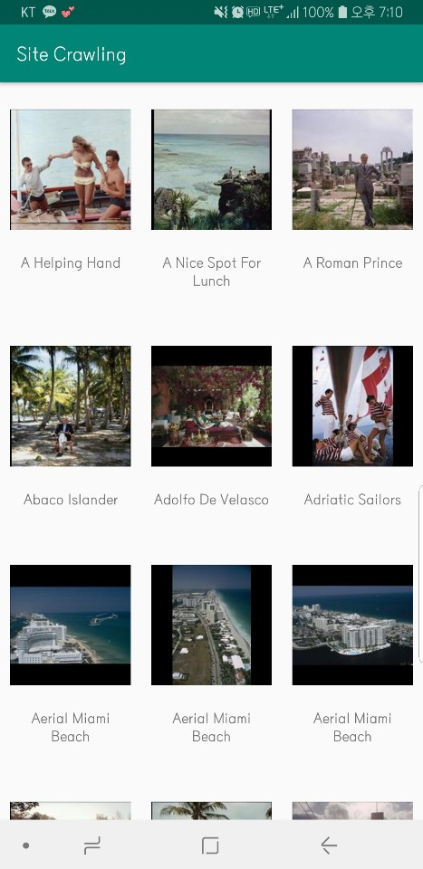

## Site Crowling Example

<br>

웹사이트에 있는 이미지들을 크롤링하여 앱의 리사이클러뷰에 띄워준다.

Image source : http://www.gettyimagesgallery.com/collections/archive/slim-aarons.aspx

<br>

#### 스크린샷

 

<br>

#### 파싱한 방법

Jsoup` 라이브러리를 활용하여 웹페이지의 `html`을 파싱한다.

- gradle에 `implementation 'org.jsoup:jsoup:1.11.2'` 추가하기

- AsyncTask 클래스 정의하기 (Jsoup 파싱은 worker thread 에서만 동작)

  - 주의사항 : html 에서 클래스명에 **공백(whitespace)이 포함되어있을 경우 . 로 교체**

  ```kotlin
  val doc = Jsoup.connect(url).get()
  val elements = doc.select("div.gallery-item-group.exitemrepeater")
  for (element in elements) {
      data.add(ImageItem(
          element.select("div.gallery-item-caption").text().trim(), 	// 이미지 제목
          element.select("img").attr("abs:src").trim()))              // 이미지 썸네일
  ```

<br>

#### To do list

- inner class 로 선언한 AsyncTask 클래스 warning 제거
- gradle 정리
- 가능하다면 페이징 구현해보기(왠지 불가능할 것 같긴 하다.)

